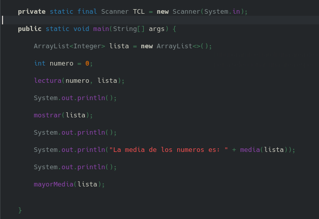
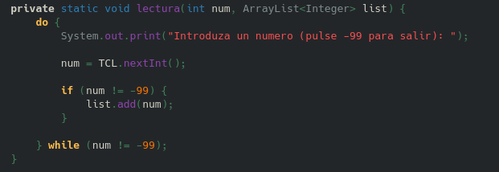
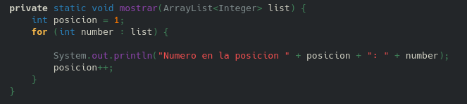
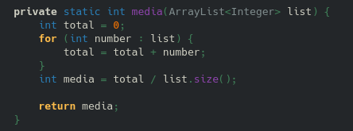
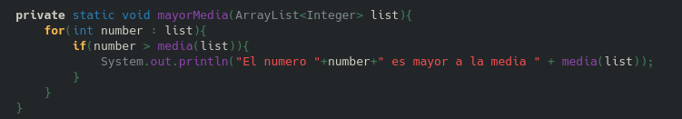

# Ejercicio 1 - Juan Jose Sanz Lopez

## Indice
1. [Main](#id1)
2. [Lectura](#id2)
3. [Mostrar](#id3)
4. [Media](#id4)
5. [Mayor que la media](#id5)

### <a name  = "id1">Codigo utilizado para el main</a>

    private static final Scanner TCL = new Scanner(System.in);

    public static void main(String[] args) {

        ArrayList<Integer> lista = new ArrayList<>();

        int numero = 0;

        lectura(numero, lista);

        System.out.println();

        mostrar(lista);

        System.out.println();

        System.out.println("La media de los numeros es: " + media(lista));

        System.out.println();

        mayorMedia(lista);

       
    }
    
### Implementación de la lectura

     private static void lectura(int num, ArrayList<Integer> list) {
        do {
            System.out.print("Introduza un numero (pulse -99 para salir): ");

            num = TCL.nextInt();

            if (num != -99) {
                list.add(num);
            }

        } while (num != -99);
    }

### Implementación de la muestra de datos

     private static void mostrar(ArrayList<Integer> list) {
        int posicion = 1;
        for (int number : list) {

            System.out.println("Numero en la posicion " + posicion + ": " + number);
            posicion++;
        }
    }

### Implementación del calculo de la media

    private static int media(ArrayList<Integer> list) {
        int total = 0;
        for (int number : list) {
            total = total + number;
        }
        int media = total / list.size();

        return media;
    }

### <a name="id5">Metodo para averiguar cual es mayor que la media</a>

    private static void mayorMedia(ArrayList<Integer> list){
        for(int number : list){
            if(number > media(list)){
                System.out.println("El numero "+number+" es mayor a la media " + media(list));
            }
        }
    }
